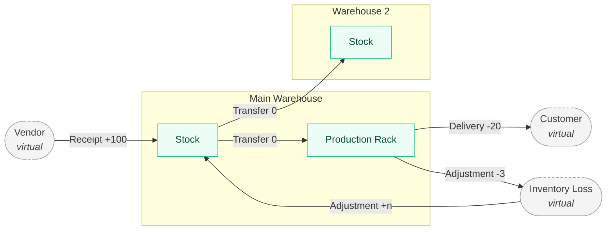

# StockSense

A modular Inventory Management System that digitizes stock operations end to end — replacing manual registers, spreadsheets, and scattered tracking with one centralized, real-time source of truth.

---

## The problem

Warehouse teams track stock across paper registers, Excel files, and individual memory. Counts drift from reality, low stock goes unnoticed until it stops production, and nobody can answer "where is this item right now" without walking the floor.

StockSense addresses that with a single ledger that records every stock movement, on-hand quantities broken down per location, and reorder alerts that fire before a shortage becomes a problem.

## Who it's for

| Role | Responsibilities |
|---|---|
| **Inventory Manager** | Manages incoming and outgoing stock, master data, warehouse configuration, reordering rules |
| **Warehouse Staff** | Performs transfers, picking, shelving, and physical counts |

---

## Core concept

Receipts, deliveries, internal transfers, and adjustments look like four separate features. They aren't. Each one is a **stock move from a source location to a destination location**, where vendors, customers, and inventory-loss are modeled as *virtual* locations.



| Operation | From | To | Net stock |
|---|---|---|---|
| Receipt | Vendor *(virtual)* | Warehouse / Stock | increase |
| Delivery Order | Warehouse / Stock | Customer *(virtual)* | decrease |
| Internal Transfer | Stock / Rack A | Stock / Rack B | unchanged, location moves |
| Adjustment | Inventory Loss ↔ Stock | either direction | increase or decrease |

Three things follow from modeling it this way:

- **Move History is a query, not a log.** It reads the same rows that moved the stock, so it cannot drift out of sync with actual quantities.
- **On-hand per location** is a sum over those rows, materialized into a quant per `(product, location)` and updated only when a document is validated.
- **One status workflow** covers all four document types: `Draft → Waiting → Ready → Done`, with `Canceled` reachable from any state.

### Worked example

Following a single product through all four operations:

```
Receive  100 kg Steel from vendor      → on hand 100   (Main / Stock)
Transfer Main/Stock → Production Rack  → on hand 100   (location changed, total unchanged)
Deliver  20 kg to customer             → on hand  80
Adjust   3 kg damaged                  → on hand  77
```

The product ends at **77 kg on hand** with **four entries** in the stock ledger — one per operation, each recording its source location, destination location, and signed quantity.

---

## Features

### Authentication
- Sign up and log in, landing on the inventory dashboard
- OTP-based password reset — request a code, verify it, set a new password
- Role-based access: Inventory Manager or Warehouse Staff

### Dashboard
Five KPIs — total products in stock, low stock / out of stock, pending receipts, pending deliveries, internal transfers scheduled.

Four filter dimensions applied live to both the KPIs and the operations list:
- Document type — receipts, delivery, internal, adjustments
- Status — draft, waiting, ready, done, canceled
- Warehouse or location
- Product category

### Products
- Create and update products: name, SKU/code, category, unit of measure, optional initial stock
- Stock availability broken down per location
- Product categories
- Reordering rules (min/max per product per warehouse) driving low-stock alerts

### Operations
- **Receipts** — add supplier and products, input received quantities, validate to increase stock
- **Delivery Orders** — pick, pack, validate to decrease stock; validation is blocked when available quantity is insufficient
- **Internal Transfers** — move stock between warehouses, locations, and racks without changing the total
- **Inventory Adjustments** — a counting sheet that reconciles recorded stock against physical count and logs the delta with a reason
- **Move History** — the full stock ledger, filterable and searchable

### Settings
- Warehouses, and a hierarchical location tree within each (`Main Warehouse → Stock → Rack A`)

### Also included
Low-stock alerts · multi-warehouse support · SKU search and smart filters

---

## Tech stack

| Layer | Choice | Rationale |
|---|---|---|
| Frontend | React + TypeScript + Vite | The UI is form- and table-heavy |
| Styling | Tailwind CSS | Dense data layouts without fighting CSS |
| Data fetching | TanStack Query | Cache invalidation after validating a document keeps KPIs honest |
| Backend | Node + Express + TypeScript | One language across the stack, shared types with the client |
| ORM | Prisma | Typed queries, migrations, and transactions around move validation |
| Database | SQLite | Zero local setup; schema stays Postgres-compatible for a later swap |
| Auth | JWT access tokens, bcrypt password hashing | OTPs hashed at rest with short expiry and an attempt cap |

**Security posture:** every API route is authenticated except signup, login, and the OTP reset endpoints. Stock validation runs inside a database transaction so a partial move can't leave quantities inconsistent.

---

## Project structure

```
stocksense/
├── client/                 # React frontend
│   └── src/
│       ├── components/     # Shared UI, app shell, tables, form controls
│       ├── features/       # auth, dashboard, products, operations, history, settings
│       ├── hooks/
│       └── lib/            # API client, formatters, validators
├── server/                 # Express API
│   ├── prisma/             # Schema, migrations, seed script
│   └── src/
│       ├── modules/        # auth, products, warehouses, stock, operations
│       ├── middleware/     # JWT verification, role guards, error handling
│       └── services/       # Stock engine: move creation, quant updates, validation
└── README.md
```

---

## Getting started

Requires Node 18 or newer.

```bash
git clone https://github.com/Rohit-o9j/stocksense.git
cd stocksense
npm install

# set up the database and load demo data
cd server
cp .env.example .env
npx prisma migrate dev
npm run seed

# from the repo root — starts API and client together
cd ..
npm run dev
```

Client runs on `http://localhost:5173`, API on `http://localhost:3000`.

The seed script creates both roles for testing, two warehouses with locations, product categories, and a populated stock ledger. Credentials are printed to the console on completion.
